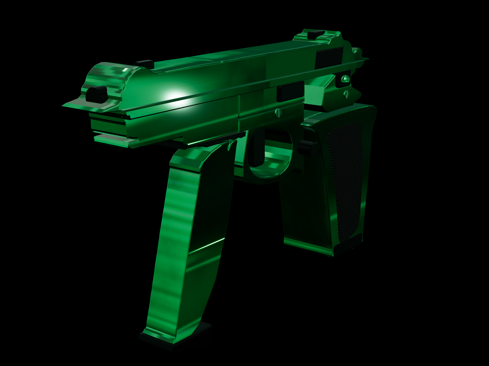

# CZ-75 Emerald Chrome — Procedural Three.js Pistol

**GitHub Pages 预览 →** https://jalensuggs.github.io/cz75-emerald-pistol/

A CZ-75 pattern pistol with an emerald-chrome finish, reconstructed as a **code-only procedural model** in Three.js from a single reference photo — no imported mesh, no downloaded asset pack. Geometry, materials, and the reference camera are all generated at runtime from measured data.

**[Live demo →](https://cz75-emerald-pistol.vercel.app)**



## What this is

- **Silhouette** — traced from the reference image's own pixels (see `src/data/profiles.json`), not hand-modeled by eye. The pistol and its spare magazine are independent objects.
- **Depth** — authored from real CZ-75 proportion ratios, since a single lateral photo carries no depth information. This is stated explicitly in code comments, not hidden.
- **Materials** — three procedural `MeshPhysicalMaterial`s (emerald chrome, black oxide steel, checkered polymer), built from canvas-generated albedo/roughness/normal/AO maps. No external textures.
- **Assembly** — 30 independently named, explodable, clickable parts with a shared runtime contract (`root.userData.sculptRuntime`).
- **Right-flank features** (ejection port, extractor) are explicitly marked as inferred, not observed — the reference photo only shows the left side.

## Run locally

```bash
npm install
npm run dev
```

Open the printed localhost URL. Left-drag to orbit, scroll to zoom, right-drag to pan.

## URL parameters

| Param | Values | Effect |
|---|---|---|
| `view` | `reference-match` \| `orbit-front-quarter` \| `orbit-rear-quarter` \| `grazing-top` | Camera preset |
| `tier` | `blockout` \| `final` | Flat-grey silhouette vs. full material pass |
| `explode` | `0`–`1` | Separate parts, scaled about the model center |
| `mode` | `eval` | Hides the HUD/controls (used for reference-matched screenshots) |

Example: `/?tier=final&view=orbit-rear-quarter&explode=0.6`

## Stack

- [Three.js](https://threejs.org/) r169 — `ExtrudeGeometry` + `InstancedMesh`, procedural canvas textures, `MeshPhysicalMaterial`
- [Vite](https://vitejs.dev/) + TypeScript, strict mode
- No external 3D assets, no textures loaded from disk — everything is generated code

## Project layout

```
src/
  createPistolModel.ts   geometry builder: extrudes, part tree, repetition systems, cameras
  materials.ts           procedural chrome / steel / polymer materials
  data/profiles.json     silhouette contours traced from the reference photo
  main.ts                scene setup, camera/view routing, dev-only screenshot endpoint
```

## Known limitations

- Reconstructed from **one lateral photo** — the right flank, top face, and interior are authored from the CZ-75 pattern, not measured.
- Grip and backstrap outlines are hand-authored splines (not traced) to avoid extruding the reference's fine surface texture into the silhouette; this trades some silhouette accuracy for a cleaner machined look.
- Tonal range on flat chrome flanks is an approximation (a smooth analytic "crown" normal, since `ExtrudeGeometry`'s cap faces have no interior tessellation to displace).
